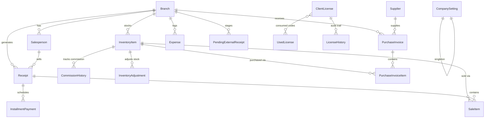

# Chapter 2: Data Models & Schema Design

**Subsystem**: Database Schema Design (Desktop — SQLite)
**Status**: ✅ SINGLE SOURCE OF TRUTH (MANDATORY GATEWAY)
**Last Updated**: 2026-07-19

> [!IMPORTANT]
> This document is the **absolute Single Source of Truth** for the VentaPOS NextGen database schema. It supersedes and replaces:
> - `_archive/04_data_models.md`
> - `_archive/database_schema.md`
> - `_archive/backend_models_doc.md`
>
> All three archived files are **deprecated**. Do NOT reference them for current schema.

---

## 1. Overview & Architecture Policies

### 1.1 Database Engine

VentaPOS NextGen is an **offline-first desktop POS application**. The database engine is **SQLite** with **WAL (Write-Ahead Logging)** mode enabled for safe concurrent reads during PyWebView operation.

```python
# settings.py
DATABASES = {
    'default': {
        'ENGINE': 'django.db.backends.sqlite3',
        'NAME': BASE_DIR / 'db.sqlite3',
    }
}
```

There is **no PostgreSQL**. There is **no cloud database**. The backend (Django) and frontend (React via PyWebView) both run locally on the cashier's machine.

### 1.2 Single-Tenant Architecture

VentaPOS NextGen is **single-tenant**. There is:
- **NO `Tenant` model**
- **NO `tenant` / `tenant_id` foreign key** on any model
- **NO Row-Level Security (RLS)**
- **NO multi-user roles** — single admin password with DRF `TokenAuthentication`

Every table belongs to exactly one installation on one machine.

### 1.3 Primary Keys

All models use Django's default **`AutoField`** (integer, auto-incrementing). There are:
- **NO UUID primary keys**
- **NO `local_id` fields** (the integer PK _is_ the local ID)

```python
# Django default — no explicit PK declaration needed
class Branch(models.Model):
    # id = AutoField(primary_key=True)  ← implicit
    name = models.CharField(max_length=150)
```

### 1.4 Soft Deletes Policy

Permanent record deletion via SQL `DELETE` is **prohibited** for all transactional models. Every model has:

```python
is_deleted = models.BooleanField(default=False)
```

- Default queries use `ActiveManager` which filters `is_deleted=False` automatically.
- The `SoftDeleteModelViewSet.destroy()` sets `is_deleted=True` instead of performing a hard `DELETE`.
- Use `Model.all_objects` (via `AllObjectsManager`) only for admin, migration, or idempotency checks.

### 1.5 Data Type Standards

| Category | Django Field Type | Notes |
|----------|------------------|-------|
| **Primary Keys** | `AutoField` / `BigAutoField` | Integer, auto-incrementing |
| **Financial Fields** | `DecimalField(max_digits=12, decimal_places=2)` | All prices, totals, commissions, expenses |
| **Quantities** | `PositiveIntegerField` / `IntegerField` | Integer only — no decimal quantities |
| **Calendar Month** | `PositiveIntegerField` | Range 1–12 |
| **Calendar Year** | `PositiveIntegerField` | ≥ 2025 |
| **Strings** | `CharField(max_length=N)` | VARCHAR equivalent |
| **Long Text** | `TextField` | For `products_text`, etc. |
| **Timestamps** | `DateTimeField(auto_now_add=True)` | UTC-aware via `USE_TZ=True` |
| **Boolean Flags** | `BooleanField(default=False)` | `is_deleted`, `is_confirmed`, etc. |
| **JSON Data** | `JSONField` | SQLite JSON1 extension (Django 3.1+) |

### 1.6 Concurrency Control

Stock adjustments must run inside an atomic transaction:

```python
from django.db import transaction

with transaction.atomic():
    item = InventoryItem.objects.select_for_update().get(id=item_id)
    if item.get_stock_at_date(month, year) >= requested_qty:
        # proceed with sale
    else:
        raise ValidationError("رصيد المخزن غير كافي")
```

### 1.7 Idempotency (Duplicate Prevention)

The `Receipt` model has a `client_uuid` field (`UUIDField`) that serves as an idempotency key from mobile devices. A unique constraint prevents duplicate receipt creation from retried sync payloads.

### 1.8 Database Row Signatures & Tamper Checking

**ClientLicense Row Integrity (`license_code_hash`)**:
- Formula: `HMAC-SHA256(expiry_date + invoices_balance + machine_id + product_id + is_active, SecretKey)`
- Validation middleware recalculates this signature. Mismatch → `is_active = FALSE`.

**Receipt Tamper-Proofing (`receipt_hash`)**:
- Formula: `HMAC-SHA256(receipt_number + total_amount + sale_month + sale_year, SecretKey)`
- Generated server-side on every save. Validated via `receipt.is_authentic` property.

### 1.9 Products Architecture

- Products are **branch-scoped**: `unique_together = ('name', 'branch')`
- **No barcode/SKU** — products identified by name only
- **No fixed selling price** on product — cashier enters price per sale
- **Commission (المندبة)**: Fixed value per product (not percentage), tracked via `CommissionHistory`
- **Collection commission (عمولة تحصيل)**: Percentage per company, stored globally on `CompanySetting.collection_commission_rate`.

### 1.10 Date System

All date-based queries use **monthly granularity** (month/year), not daily. The `initial_month`/`initial_year` pattern is used for opening balances, and all ledger queries aggregate up to a given `(month, year)`.

### 1.11 Customers

Customers are **implicit** — text fields on receipts (`customer_name`, `phone_number`, `address`, `area`). There is **no Customer model**.

### 1.12 Installments

Installment schedules follow the **25th-of-month rule**: due dates auto-generate starting from the 25th of the month following the sale. There is **no collection tracking** — schedule only.

### 1.13 Printing

Printing uses backend `os.startfile()` / SumatraPDF for silent local print. This is expected and permitted because the backend runs locally.

### 1.14 Recovery Code

Product ID `16` ("كود الطوارئ") is a special license type stored in the `client_license` table. It serves as the recovery mechanism.

---

## 2. Egyptian Market Terminology Mapping

| Django Model | DB Table | Egyptian Market Term (UI) |
|:---|:---|:---|
| `Branch` | `salesapp_branch` | **المخزن** / **الفرع** |
| `Salesperson` | `salesapp_salesperson` | **المندوب** |
| `InventoryItem` | `salesapp_inventoryitem` | **البضاعة** / **الصنف** |
| `CommissionHistory` | `salesapp_commissionhistory` | **سجل المندبات** / **العمولات** |
| `InventoryAdjustment` | `salesapp_inventoryadjustment` | **دفتر الجرد والتسويات** |
| `Supplier` | `salesapp_supplier` | **المورد** / **الموردين** |
| `PurchaseInvoice` | `salesapp_purchaseinvoice` | **شراء بضاعة** / **مرتجع للمورد** |
| `PurchaseInvoiceItem` | `salesapp_purchaseinvoiceitem` | **أصناف فاتورة الشراء** |
| `Receipt` | `salesapp_receipt` | **الفاتورة** / **الوصل** |
| `SaleItem` | `salesapp_saleitem` | **الأصناف المباعة** |
| `InstallmentPayment` | `salesapp_installmentpayment` | **القسط** / **الأقساط** |
| `Expense` | `salesapp_expense` | **المصاريف** / **الخزنة** |
| `CompanySetting` | `salesapp_companysetting` | **إعدادات الشركة** |
| `ClientLicense` | `salesapp_clientlicense` | **الترخيص** / **الكود** |
| `UsedLicense` | `salesapp_usedlicense` | **الأكواد المستخدمة** |
| `LicenseHistory` | `salesapp_licensehistory` | **أرشيف التراخيص** |
| `PendingExternalReceipt` | `salesapp_pendingexternalreceipt` | **الفواتير الخارجية المعلقة** |

---

## 3. Model Reference

### Removed Models (NOT in NextGen)

| Model | Reason |
|-------|--------|
| `Tenant` | Single-tenant architecture — no multi-company support |
| `CloudUser` | Removed — single admin password auth only |
| `ActionLog` | Removed — legacy logging model |
| `SyncDeletionLog` | Legacy sync tracking — replaced by soft deletes |

---

### 3.1 Branch (`salesapp_branch`)

**Description**: Physical branch or warehouse. Also holds the collection commission rate for that branch.

| Field | Type | Constraints | Notes |
|---|---|---|---|
| `id` | BigAutoField | PK | |
| `name` | CharField(150) | UNIQUE, NOT NULL | Branch display name |
| `is_deleted` | BooleanField | DEFAULT False | Soft delete flag |
| `created_at` | DateTimeField | auto_now_add | |

> **Note on Deletion**: While the system uses soft deletes via `is_deleted=True` for normal operations, `BranchViewSet.destroy` is explicitly overridden to perform a full, irreversible **hard delete cascade** of the branch and ALL its related operational data (Receipts, Invoices, Salespersons, etc.) upon user request, ignoring standard PROTECT configurations.

**Constraints**: `UNIQUE(name)`

---

### 3.2 Salesperson (`salesapp_salesperson`)

**Description**: Sales representative (المندوب), assigned to a branch. Commission-only salary, no base salary.

| Field | Type | Constraints | Notes |
|-------|------|-------------|-------|
| `id` | AutoField | PK | |
| `name` | CharField(100) | NOT NULL | |
| `branch` | FK → Branch | ON DELETE PROTECT | |
| `device_token` | UUIDField | DEFAULT uuid4, nullable | Mobile device auth token |
| `is_device_active` | BooleanField | DEFAULT FALSE | Mobile device enabled |
| `is_deleted` | BooleanField | DEFAULT FALSE | |
| `created_at` | DateTimeField | auto_now_add | |

**Constraints**: `UNIQUE(name, branch)`

---

### 3.3 InventoryItem (`salesapp_inventoryitem`)

**Description**: Product/catalog entry (البضاعة), scoped to a branch. No barcode, no SKU — identified by name only. No fixed selling price — cashier enters price per sale.

| Field | Type | Constraints | Notes |
|-------|------|-------------|-------|
| `id` | AutoField | PK | |
| `name` | CharField(200) | NOT NULL | Product display name |
| `branch` | FK → Branch | ON DELETE PROTECT | Branch scope |
| `initial_quantity` | PositiveIntegerField | DEFAULT 0 | Opening stock (integer) |
| `initial_purchase_price` | DecimalField(12,2) | DEFAULT 0.00 | Opening cost price |
| `initial_commission_amount` | DecimalField(12,2) | DEFAULT 0.00 | Opening commission (المندبة) per unit |
| `initial_month` | PositiveIntegerField | DEFAULT 1, range 1–12 | Opening balance month |
| `initial_year` | PositiveIntegerField | DEFAULT 2026, ≥ 2025 | Opening balance year |
| `is_deleted` | BooleanField | DEFAULT FALSE | |
| `created_at` | DateTimeField | auto_now_add | |
| `updated_at` | DateTimeField | auto_now | |

**Constraints**: `UNIQUE(name, branch)`
**Ordering**: `['name']`

---

### 3.4 CommissionHistory (`salesapp_commissionhistory`)

**Description**: Tracks commission rate changes over time for a product (سجل المندبات). When the per-unit commission (المندبة) changes for a product, a new record is inserted here.

| Field | Type | Constraints | Notes |
|-------|------|-------------|-------|
| `id` | AutoField | PK | |
| `item` | FK → InventoryItem | ON DELETE CASCADE, related_name=`commission_records` | |
| `commission_amount` | DecimalField(12,2) | NOT NULL | New commission value per unit |
| `activation_month` | PositiveIntegerField | range 1–12 | Month when this rate takes effect |
| `activation_year` | PositiveIntegerField | ≥ 2025 | Year when this rate takes effect |
| `is_deleted` | BooleanField | DEFAULT FALSE | |
| `created_at` | DateTimeField | auto_now_add | |

**Constraints**: `UNIQUE(item, activation_month, activation_year)`
**Ordering**: `['-activation_year', '-activation_month']`

---

### 3.5 InventoryAdjustment (`salesapp_inventoryadjustment`)

**Description**: Stock correction entries — deficit (عجز) or surplus (زيادة).

| Field | Type | Constraints | Notes |
|-------|------|-------------|-------|
| `id` | AutoField | PK | |
| `item` | FK → InventoryItem | ON DELETE CASCADE, related_name=`adjustments` | |
| `adjustment_type` | CharField(10) | CHECK IN (`DEFICIT`, `SURPLUS`) | |
| `quantity` | PositiveIntegerField | NOT NULL | Integer — units adjusted |
| `reason` | CharField(255) | nullable | Optional explanation |
| `month` | PositiveIntegerField | range 1–12 | Adjustment month |
| `year` | PositiveIntegerField | ≥ 2025 | Adjustment year |
| `is_deleted` | BooleanField | DEFAULT FALSE | |
| `created_at` | DateTimeField | auto_now_add | |

**Ordering**: `['-year', '-month', '-id']`

---

### 3.6 Supplier (`salesapp_supplier`)

**Description**: Procurement vendor entity (المورد).

| Field | Type | Constraints | Notes |
|-------|------|-------------|-------|
| `id` | AutoField | PK | |
| `name` | CharField(200) | UNIQUE, NOT NULL | |
| `is_deleted` | BooleanField | DEFAULT FALSE | |
| `created_at` | DateTimeField | auto_now_add | |

**Constraints**: `UNIQUE(name)`

---

### 3.7 PurchaseInvoice (`salesapp_purchaseinvoice`)

**Description**: Vendor purchase or return invoice header (فاتورة الشراء / المرتجع).

| Field | Type | Constraints | Notes |
|-------|------|-------------|-------|
| `id` | AutoField | PK | |
| `branch` | FK → Branch | ON DELETE PROTECT | |
| `supplier` | FK → Supplier | ON DELETE PROTECT | |
| `invoice_number` | PositiveIntegerField | UNIQUE, NOT NULL | Human-readable invoice number |
| `invoice_type` | CharField(20) | CHECK IN (`PURCHASE`, `RETURN`) DEFAULT `PURCHASE` | |
| `invoice_month` | PositiveIntegerField | range 1–12, db_index | |
| `invoice_year` | PositiveIntegerField | ≥ 2025, db_index | |
| `is_deleted` | BooleanField | DEFAULT FALSE | |
| `created_at` | DateTimeField | auto_now_add | |

**Constraints**: `UNIQUE(branch, invoice_number, supplier)`
**Ordering**: `['-invoice_year', '-invoice_month', '-id']`

---

### 3.8 PurchaseInvoiceItem (`salesapp_purchaseinvoiceitem`)

**Description**: Line item within a purchase or return invoice (بند فاتورة المشتريات).

| Field | Type | Constraints | Notes |
|-------|------|-------------|-------|
| `id` | AutoField | PK | |
| `invoice` | FK → PurchaseInvoice | ON DELETE CASCADE, related_name=`items` | |
| `inventory_item` | FK → InventoryItem | ON DELETE PROTECT | |
| `quantity` | PositiveIntegerField | DEFAULT 1 | Integer quantity |
| `purchase_price` | DecimalField(12,2) | DEFAULT 0.00, nullable | Price per unit at time of purchase |
| `is_deleted` | BooleanField | DEFAULT FALSE | |
| `created_at` | DateTimeField | auto_now_add | |

---

### 3.9 Receipt (`salesapp_receipt`)

**Description**: Sales transaction / invoice record (الفاتورة / الوصل). Central financial entity. Customer data is stored as inline text fields — no Customer model FK.

| Field | Type | Constraints | Notes |
|-------|------|-------------|-------|
| `id` | AutoField | PK | |
| `branch` | FK → Branch | ON DELETE PROTECT, db_index | |
| `salesperson` | FK → Salesperson | ON DELETE PROTECT, nullable | |
| `receipt_number` | PositiveIntegerField | NOT NULL, db_index | Human-readable invoice number |
| `client_uuid` | UUIDField | NOT NULL | Idempotency key from mobile device |
| `receipt_hash` | CharField(64) | nullable | HMAC-SHA256 tamper-proof signature |
| `customer_name` | CharField(150) | blank allowed, db_index | العميل — implicit customer |
| `phone_number` | CharField(20) | blank allowed, db_index | |
| `address` | CharField(255) | blank allowed | |
| `area` | CharField(100) | blank allowed, db_index | المنطقة |
| `total_amount` | DecimalField(12,2) | DEFAULT 0.00 | Total invoice amount |
| `down_payment` | DecimalField(12,2) | DEFAULT 0.00 | المقدم |
| `installment_system` | CharField(200) | blank allowed | Description of installment plan |
| `sale_year` | PositiveIntegerField | NOT NULL, db_index | |
| `sale_month` | PositiveIntegerField | NOT NULL, db_index | |
| `is_cash_sale` | BooleanField | DEFAULT FALSE | نقدية أم آجلة |
| `products_text` | TextField | nullable | Denormalized product summary for print |
| `source` | CharField(20) | DEFAULT `DESKTOP` | `DESKTOP` or `MOBILE` |
| `sync_action` | CharField(20) | DEFAULT `NEW` | Sync operation indicator |
| `is_confirmed` | BooleanField | DEFAULT TRUE | Master POS confirmation flag |
| `is_deleted` | BooleanField | DEFAULT FALSE | |
| `created_at` | DateTimeField | auto_now_add | |
| `updated_at` | DateTimeField | auto_now | |

**Constraints**: `UNIQUE(branch, receipt_number)`
**Ordering**: `['-receipt_number']`

> [!IMPORTANT]
> The `receipt_hash` is generated on every `save()` using `HMAC-SHA256(receipt_number + total_amount + sale_month + sale_year)`. The `is_authentic` property re-validates this hash at read time.

> [!NOTE]
> The `client_uuid` field provides idempotency for mobile sync. Duplicate pushes with the same `client_uuid` are safely rejected.

---

### 3.10 SaleItem (`salesapp_saleitem`)

**Description**: Individual sold product line within a receipt (الأصناف المباعة).

| Field | Type | Constraints | Notes |
|-------|------|-------------|-------|
| `id` | AutoField | PK | |
| `receipt` | FK → Receipt | ON DELETE CASCADE, related_name=`items` | |
| `inventory_item` | FK → InventoryItem | ON DELETE PROTECT | |
| `quantity` | PositiveIntegerField | DEFAULT 1 | Integer — units sold |
| `unit_price` | DecimalField(12,2) | NOT NULL | Selling price per unit (entered by cashier) |
| `is_deleted` | BooleanField | DEFAULT FALSE | |
| `created_at` | DateTimeField | auto_now_add | |

---

### 3.11 InstallmentPayment (`salesapp_installmentpayment`)

**Description**: Scheduled installment payment tied to a receipt (القسط المجدول). Schedule only — no collection tracking.

| Field | Type | Constraints | Notes |
|-------|------|-------------|-------|
| `id` | AutoField | PK | |
| `receipt` | FK → Receipt | ON DELETE CASCADE, related_name=`payments` | |
| `payment_date` | DateField | NOT NULL | Due date — 25th-of-month rule |
| `amount` | DecimalField(12,2) | NOT NULL | Installment amount |
| `is_deleted` | BooleanField | DEFAULT FALSE | |
| `created_at` | DateTimeField | auto_now_add | |

> [!NOTE]
> **25th-of-month rule**: Installment due dates are auto-generated starting from the 25th of the month following the sale date. Example: sale on 2026-03-10 → first installment due 2026-04-25.

---

### 3.12 Expense (`salesapp_expense`)

**Description**: Operational overhead expense logged against a branch (المصاريف / الخزنة).

| Field | Type | Constraints | Notes |
|-------|------|-------------|-------|
| `id` | AutoField | PK | |
| `branch` | FK → Branch | ON DELETE CASCADE | |
| `amount` | DecimalField(12,2) | NOT NULL | |
| `description` | CharField(255) | NOT NULL | بند الصرف |
| `expense_year` | IntegerField | NOT NULL | |
| `expense_month` | IntegerField | NOT NULL | |
| `is_deleted` | BooleanField | DEFAULT FALSE | |
| `created_at` | DateTimeField | auto_now_add | |

---

### 3.13 CompanySetting (`salesapp_companysetting`)

**Description**: Company profile settings. Singleton pattern — only one row exists in the table.

| Field | Type | Constraints | Notes |
|-------|------|-------------|-------|
| `id` | AutoField | PK | |
| `name` | CharField(100) | NOT NULL | اسم الشركة |
| `description` | TextField | NULL, BLANK | |
| `phone1` | CharField(50) | NULL, BLANK | Primary support/contact |
| `phone2` | CharField(50) | NULL, BLANK | Secondary contact |
| `footer_text` | TextField | NULL, BLANK | Receipt footer note |
| `is_cloud_viewer` | BooleanField | DEFAULT False | Feature toggle |
| `collection_commission_rate` | DecimalField(5,2) | DEFAULT 0.00 | Global collection commission (%) |
| `zoom_level` | DecimalField(4,2) | DEFAULT 1.00 | Global UI zoom level multiplier |
| `is_deleted` | BooleanField | DEFAULT False | |
| `created_at` | DateTimeField | auto_now_add | |

**Singleton Enforcement**: The `save()` method prevents creation of a second row — redirects to update the existing one.

---

### 3.14 ClientLicense (`salesapp_clientlicense`)

**Description**: Active POS device activation profile with cryptographic row integrity (الترخيص). Recovery codes are stored as product_id=16 in this same table.

| Field | Type | Constraints | Notes |
|-------|------|-------------|-------|
| `id` | AutoField | PK | |
| `product_id` | IntegerField | BETWEEN 1 AND 16 | License product type (see table below) |
| `start_date` | DateField | nullable | Activation date |
| `expiry_date` | DateField | nullable | Time-based license expiry |
| `invoices_balance` | PositiveIntegerField | DEFAULT 0 | Remaining invoice quota |
| `is_active` | BooleanField | DEFAULT TRUE | License enabled |
| `machine_id` | CharField(255) | nullable | Hardware fingerprint (auto-set on save) |
| `company_code` | CharField(10) | nullable | Company code for online features |
| `license_code_hash` | CharField(64) | nullable | HMAC-SHA256 row integrity signature |
| `is_online_active` | BooleanField | DEFAULT FALSE | Cloud subscription status |
| `online_start_date` | DateField | nullable | Cloud subscription start |
| `online_expiry_date` | DateField | nullable | Cloud subscription expiry |
| `last_checkin` | DateTimeField | auto_now | Updated on every save |
| `is_deleted` | BooleanField | DEFAULT FALSE | |
| `created_at` | DateTimeField | auto_now_add | |

**Product ID Reference**:

| product_id | Name | Type |
|:---:|------|------|
| 1 | تجربة مجانية (Trial 60 Days) | Time-limited |
| 2 | طباعة فقط - سنة واحدة | Time-limited |
| 3 | طباعة فقط - مدى الحياة | Lifetime |
| 4 | إدارة كاملة - سنة واحدة | Time-limited |
| 5 | إدارة كاملة - 3 سنوات | Time-limited |
| 6 | إدارة كاملة - 5 سنوات | Time-limited |
| 7 | إدارة كاملة - مدى الحياة (VIP) | Lifetime |
| 8 | إضافة الأونلاين - سنة | Time-limited add-on |
| 9 | إضافة الأونلاين - 5 سنوات | Time-limited add-on |
| 10 | كود شحن (100 فاتورة) | Recharge |
| 11 | كود شحن (300 فاتورة) | Recharge |
| 12 | كود شحن (500 فاتورة) | Recharge |
| 13 | كود شحن (1000 فاتورة) | Recharge |
| 14 | كود شحن (3000 فاتورة) | Recharge |
| 15 | كود شحن (5000 فاتورة) | Recharge |
| 16 | كود الطوارئ (استعادة وضبط) | **Recovery** |

**Signature Formula**:
```python
license_code_hash = HMAC-SHA256(
    expiry_date + invoices_balance + machine_id + product_id + is_active,
    SecretKey
)
```

> [!CAUTION]
> Any direct SQL UPDATE to `invoices_balance`, `expiry_date`, or `is_active` without recalculating `license_code_hash` will be detected by the validation middleware and will trigger `SET is_active = FALSE`.

**Key Business Methods on ClientLicense**:

- **`is_expired` (property)**: Returns `False` for lifetime products (3, 7) and recharge codes (≥ 10). Returns `True` if `expiry_date` has passed.
- **`get_active_license()` (classmethod)**: Merges all valid active licenses into a single virtual license object with aggregated balance, widest date range, and highest product tier.

---

### 3.15 UsedLicense (`salesapp_usedlicense`)

**Description**: Registry of consumed activation codes — prevents replay attacks (الأكواد المستخدمة).

| Field | Type | Constraints | Notes |
|-------|------|-------------|-------|
| `id` | AutoField | PK | |
| `code_hash` | CharField(64) | UNIQUE NOT NULL | SHA-256 of raw license code |
| `used_at` | DateTimeField | auto_now_add | |
| `is_deleted` | BooleanField | DEFAULT FALSE | |

---

### 3.16 LicenseHistory (`salesapp_licensehistory`)

**Description**: Append-only audit log of all licensing operations (أرشيف التراخيص).

| Field | Type | Constraints | Notes |
|-------|------|-------------|-------|
| `id` | AutoField | PK | |
| `machine_id` | CharField(100) | NOT NULL | Hardware fingerprint at time of operation |
| `product_name` | CharField(100) | NOT NULL | Display name of the licensed product |
| `operation_type` | CharField(50) | NOT NULL, DEFAULT "تجديد/تفعيل" | e.g., `ACTIVATE`, `RENEW`, `REVOKE` |
| `start_date` | DateField | nullable | License period start |
| `end_date` | DateField | nullable | License period end |
| `added_balance` | IntegerField | DEFAULT 0 | Invoices added in this operation |
| `archived_at` | DateTimeField | auto_now_add | Timestamp of this operation |
| `status` | CharField(50) | NOT NULL, DEFAULT "أرشيف" | `SUCCESS`, `FAILED`, etc. |
| `is_deleted` | BooleanField | DEFAULT FALSE | |

---

### 3.17 PendingExternalReceipt (`salesapp_pendingexternalreceipt`)

**Description**: Temporary staging table for external receipts awaiting desktop processing and approval (الفواتير الخارجية المعلقة).

| Field | Type | Constraints | Notes |
|-------|------|-------------|-------|
| `id` | AutoField | PK | |
| `branch` | FK → Branch | ON DELETE CASCADE | Target branch |
| `batch_id` | CharField(100) | DEFAULT '', blank allowed | Groups related external receipts |
| `source` | CharField(20) | CHECK IN (`CLOUD`, `USB`, `FILE`) | Origin of data |
| `payload` | JSONField | NOT NULL | Raw receipt data as JSON |
| `is_processed` | BooleanField | DEFAULT FALSE | Has been reviewed and imported |
| `is_deleted` | BooleanField | DEFAULT FALSE | |
| `created_at` | DateTimeField | auto_now_add | |

**Ordering**: `['-created_at']`

---

## 4. Business Methods

### 4.1 `InventoryItem.get_stock_at_date(month, year)`

Computes the net stock for a product at a given month/year using the **time-machine ledger** pattern.

**Formula**:
```
final_stock = max(0,
    initial_quantity
    + Σ purchases(≤ month/year)
    + Σ surplus_adjustments(≤ month/year)
    − Σ sales(≤ month/year)
    − Σ returns(≤ month/year)
    − Σ deficit_adjustments(≤ month/year)
)
```

**Implementation** (from [models.py](file:///d:/Projects/VentaPOS/Desktop/sales/salesapp/models.py#L152-L189)):

```python
def get_stock_at_date(self, month, year):
    # 1. Before opening date → return 0
    if year < self.initial_year or (year == self.initial_year and month < self.initial_month):
        return 0

    # 2. Purchases (PURCHASE type invoices up to month/year)
    total_purchased = self.purchaseinvoiceitem_set.filter(
        invoice__invoice_type='PURCHASE'
    ).filter(
        Q(invoice__invoice_year__lt=year) |
        Q(invoice__invoice_year=year, invoice__invoice_month__lte=month)
    ).aggregate(total=Sum('quantity'))['total'] or 0

    # 3. Returns (RETURN type invoices up to month/year)
    total_returned = self.purchaseinvoiceitem_set.filter(
        invoice__invoice_type='RETURN'
    ).filter(
        Q(invoice__invoice_year__lt=year) |
        Q(invoice__invoice_year=year, invoice__invoice_month__lte=month)
    ).aggregate(total=Sum('quantity'))['total'] or 0

    # 4. Sales
    total_sold = self.saleitem_set.filter(
        Q(receipt__sale_year__lt=year) |
        Q(receipt__sale_year=year, receipt__sale_month__lte=month)
    ).aggregate(total=Sum('quantity'))['total'] or 0

    # 5. Adjustments
    adjustments = self.adjustments.filter(
        Q(year__lt=year) | Q(year=year, month__lte=month)
    )
    total_deficit = adjustments.filter(
        adjustment_type='DEFICIT'
    ).aggregate(total=Sum('quantity'))['total'] or 0
    total_surplus = adjustments.filter(
        adjustment_type='SURPLUS'
    ).aggregate(total=Sum('quantity'))['total'] or 0

    # 6. Final formula with max(0,...) clamp
    final_stock = (
        self.initial_quantity + total_purchased + total_surplus
    ) - (total_sold + total_returned + total_deficit)
    return max(0, final_stock)
```

> [!TIP]
> The `max(0, ...)` clamp prevents negative stock display. Stock can go logically negative due to out-of-order sync, but the UI always shows ≥ 0.

---

### 4.2 `InventoryItem.get_commission_at_date(month, year)`

Returns the effective sales commission (المندبة) for a product at a given period. Looks up the latest `CommissionHistory` entry at or before the given date, falling back to `initial_commission_amount`.

```python
def get_commission_at_date(self, month, year):
    latest_comm = self.commission_records.filter(
        activation_year__lte=year
    ).filter(
        Q(activation_year__lt=year) | Q(activation_month__lte=month)
    ).order_by('-activation_year', '-activation_month', '-id').first()

    if latest_comm:
        return latest_comm.commission_amount
    return self.initial_commission_amount
```

---

### 4.3 `InventoryItem.get_price_at_date(month, year)`

Returns the latest purchase price recorded at or before the given date, falling back to `initial_purchase_price`.

```python
def get_price_at_date(self, month, year):
    latest_purchase = self.purchaseinvoiceitem_set.filter(
        invoice__invoice_type='PURCHASE',
        invoice__invoice_year__lte=year
    ).filter(
        Q(invoice__invoice_year__lt=year) | Q(invoice__invoice_month__lte=month)
    ).order_by('-invoice__invoice_year', '-invoice__invoice_month', '-id').first()

    if latest_purchase:
        return latest_purchase.purchase_price
    return self.initial_purchase_price
```

---

### 4.4 `Receipt.get_next_receipt_number(branch)` (classmethod)

Auto-assigns the next sequential receipt number for a branch:

```python
@classmethod
def get_next_receipt_number(cls, branch):
    last_num = cls.objects.filter(branch=branch).aggregate(
        Max('receipt_number')
    )['receipt_number__max']
    return (last_num or 0) + 1
```

---

### 4.5 `Receipt.is_authentic` (property)

Validates the receipt's HMAC signature at read time:

```python
@property
def is_authentic(self):
    from .security_utils import generate_receipt_signature
    expected_hash = generate_receipt_signature(
        self.receipt_number, self.total_amount, self.sale_month, self.sale_year
    )
    return self.receipt_hash == expected_hash
```

---

## 5. Serializer Reference

| Serializer | Model | Nested Fields | Notes |
|-----------|-------|---------------|-------|
| `BranchSerializer` | Branch | — | Includes `collection_commission_rate` |
| `SalespersonSerializer` | Salesperson | — | |
| `InventoryItemSerializer` | InventoryItem | — | Adds computed `current_stock` field |
| `CommissionHistorySerializer` | CommissionHistory | — | |
| `InventoryAdjustmentSerializer` | InventoryAdjustment | — | |
| `SupplierSerializer` | Supplier | — | |
| `PurchaseInvoiceSerializer` | PurchaseInvoice | `items` (writable nested) | Creates nested `PurchaseInvoiceItem` on POST |
| `PurchaseInvoiceItemSerializer` | PurchaseInvoiceItem | — | |
| `ReceiptSerializer` | Receipt | `sale_items`, `installment_payments` | Generates hash, deducts license balance atomically |
| `SaleItemSerializer` | SaleItem | — | |
| `InstallmentPaymentSerializer` | InstallmentPayment | — | |
| `ExpenseSerializer` | Expense | — | |
| `CompanySettingSerializer` | CompanySetting | — | |
| `ClientLicenseSerializer` | ClientLicense | — | `license_code_hash` read-only |
| `UsedLicenseSerializer` | UsedLicense | — | |
| `LicenseHistorySerializer` | LicenseHistory | — | |
| `PendingExternalReceiptSerializer` | PendingExternalReceipt | — | |

---

## 6. ViewSet & Endpoint Reference

### 6.1 Standard CRUD ViewSets

All standard viewsets inherit from `SoftDeleteModelViewSet`:
- `destroy()` performs **soft-delete** (`is_deleted=True`) instead of hard `DELETE`.
- Querysets use `ActiveManager` to filter deleted records automatically.

| ViewSet | Base URL | Filters |
|---------|----------|---------|
| `BranchViewSet` | `/api/v1/branches/` | — |
| `SalespersonViewSet` | `/api/v1/salespeople/` | — |
| `InventoryItemViewSet` | `/api/v1/inventory/` | `?branch_id=` `?month=` `?year=` |
| `CommissionHistoryViewSet` | `/api/v1/commission-history/` | `?item_id=` |
| `InventoryAdjustmentViewSet` | `/api/v1/inventory-adjustments/` | — |
| `SupplierViewSet` | `/api/v1/suppliers/` | — |
| `PurchaseInvoiceViewSet` | `/api/v1/purchase-invoices/` | — |
| `PurchaseInvoiceItemViewSet` | `/api/v1/purchase-invoice-items/` | — |
| `ReceiptViewSet` | `/api/v1/receipts/` | `?branch_id=` `?salesperson_id=` `?is_cash_sale=` |
| `SaleItemViewSet` | `/api/v1/sale-items/` | — |
| `InstallmentPaymentViewSet` | `/api/v1/installment-payments/` | — |
| `ExpenseViewSet` | `/api/v1/expenses/` | `?branch_id=` `?year=` `?month=` |
| `CompanySettingViewSet` | `/api/v1/company-settings/` | — |
| `ClientLicenseViewSet` | `/api/v1/client-licenses/` | — |
| `UsedLicenseViewSet` | `/api/v1/used-licenses/` | — |
| `LicenseHistoryViewSet` | `/api/v1/license-history/` | — |
| `PendingExternalReceiptViewSet` | `/api/v1/pending-external-receipts/` | — |

### 6.2 Custom Actions on InventoryItemViewSet

| Action | Method | URL | Description |
|--------|--------|-----|-------------|
| `get_safe_available_qty` | GET | `/api/v1/inventory/{pk}/get_safe_available_qty/` | Pessimistic minimum stock projection |
| `pos_search` | GET | `/api/v1/inventory/pos_search/` | High-performance POS product search |

### 6.3 Custom Actions on ReceiptViewSet

| Action | Method | URL | Description |
|--------|--------|-----|-------------|
| `printers` | GET | `/api/v1/receipts/printers/` | Retrieve locally configured POS printer names |

### 6.4 Special API Views

| View | Method | URL | Description |
|------|--------|-----|-------------|
| `ApprovePendingReceiptView` | POST | `/tools/sync/approve-pending/<int:pk>/` | Approve pending offline receipts |
| `LicenseStatusView` | GET | `/api/v1/license/status/` | Current balance and expiry |
| `LicenseActivateView` | POST | `/api/v1/license/activate/` | Validate and activate a license code |

---

## 7. Database Indexes

### 7.1 Implicit Indexes (Django-managed)

Django automatically creates indexes for:
- All primary key fields (`id`)
- All `ForeignKey` fields
- All fields with `db_index=True`
- All `unique=True` / `unique_together` constraints

### 7.2 Recommended Application-Level Indexes

```python
# In Meta.indexes or via RunSQL migration

# Receipts — common query patterns
class Receipt(models.Model):
    class Meta:
        indexes = [
            models.Index(fields=['branch', 'sale_year', 'sale_month']),
            models.Index(fields=['receipt_hash']),
            models.Index(fields=['customer_name']),
            models.Index(fields=['phone_number']),
            models.Index(fields=['area']),
        ]

# Inventory — branch + name lookup
class InventoryItem(models.Model):
    class Meta:
        indexes = [
            models.Index(fields=['branch', 'name']),
        ]

# Purchase Invoices — date filtering
class PurchaseInvoice(models.Model):
    class Meta:
        indexes = [
            models.Index(fields=['invoice_year', 'invoice_month']),
        ]

# Expenses — branch + date filtering
class Expense(models.Model):
    class Meta:
        indexes = [
            models.Index(fields=['branch', 'expense_year', 'expense_month']),
        ]

# Licensing
class ClientLicense(models.Model):
    class Meta:
        indexes = [
            models.Index(fields=['license_code_hash']),
            models.Index(fields=['machine_id']),
        ]
```

> [!NOTE]
> SQLite does not support **partial indexes** via Django's `Meta.indexes`. The `is_deleted` filtering is handled at the application layer by `ActiveManager`. If migrating to PostgreSQL in the future, add `WHERE is_deleted = FALSE` partial indexes via `RunSQL`.

---

## 8. Managers

| Manager | Class | Assigned As | Description |
|---------|-------|-------------|-------------|
| Default | `ActiveManager` | `objects` | Filters `is_deleted=False` automatically on all queries |
| Unfiltered | `AllObjectsManager` | `all_objects` | Returns ALL records including soft-deleted — use for admin/migration/idempotency only |
| Receipt-specific | `ValidReceiptManager` | `objects` (on Receipt) | Extends ActiveManager: also excludes receipts with null/empty `receipt_hash` and receipts beyond license expiry date |

```python
class ActiveManager(models.Manager):
    def get_queryset(self):
        return super().get_queryset().filter(is_deleted=False)

class AllObjectsManager(models.Manager):
    """Unfiltered manager — use only for admin/migration purposes."""
    pass
```

> [!WARNING]
> Always use `Model.all_objects` when checking for soft-deleted records (e.g., idempotency checks in sync push). Using `Model.objects` will silently miss deleted records and may create unintended duplicates.

---

## 9. Entity-Relationship Diagram


