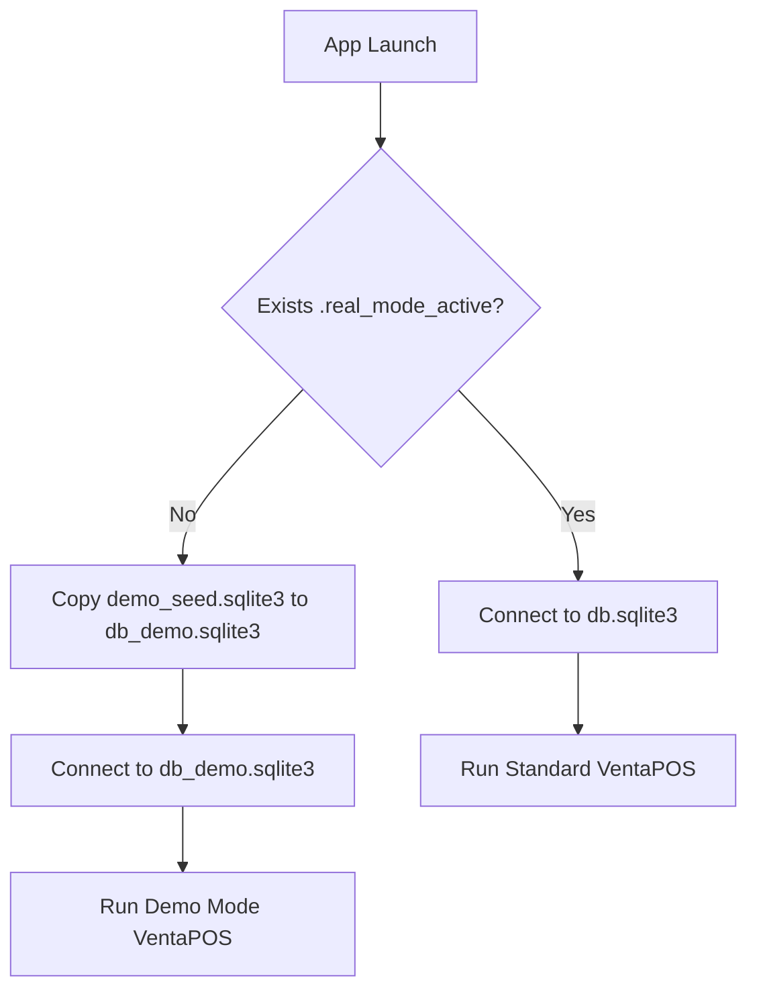

# Demo Mode Architecture

This document outlines the architecture and workflow for the VentaPOS NextGen Demo Mode (الوضع التجريبي).

## 1. Overview

To provide clients with an immediate, frictionless trial experience, VentaPOS NextGen boots directly into a **Demo Mode** on the very first launch. This mode bypasses the standard System Initialization wizard and drops the user into a fully populated, functioning POS environment with dummy data.

## 2. Ephemeral Database Strategy

The Demo Mode is entirely isolated from the production environment:
- **Seed File**: The application includes a pre-filled SQLite database file named `demo_seed.sqlite3` in its deployment bundle. This file contains realistic Egyptian dummy data (inventory items, previous receipts, suppliers, and a demo license).
- **Working Copy**: Upon starting the application in Demo Mode, the system copies `demo_seed.sqlite3` to `db_demo.sqlite3`. Django connects exclusively to `db_demo.sqlite3`.
- **Ephemeral Nature**: Every time the application is closed and reopened in Demo Mode, `db_demo.sqlite3` is overwritten with a fresh copy of `demo_seed.sqlite3`. This ensures any receipts or modifications made during the trial session are completely wiped, preventing actual usage on a demo database.

## 3. Activation Flow

While in Demo Mode, the user sees a persistent UI banner:
> **"وضع تجريبي - اضغط هنا لتفعيل النسخة الأصلية"** (Demo Mode - Click here to activate).

When the user clicks this banner:
1. The frontend directs them to the standard **System Init Wizard**.
2. The user fills out their company details, admin password, and enters their **License Code**.
3. Upon submitting, the backend API (`/api/activate-real/`):
   - Validates the license cryptographically.
   - Saves the initialization details to a *fresh* production database (`db.sqlite3`).
   - Creates a hidden file `.real_mode_active` on the filesystem.
   - Restarts the application (PyWebView).

## 4. Startup Boot Sequence

When the Python executable starts, it performs the following checks:

## 5. Security & Isolation

- **License Generator**: The tool used to generate activation keys (`LicenseManager`) is strictly an offline developer tool and is **not** bundled with VentaPOS NextGen.
- **Data Protection**: Since Demo Mode uses a physically separate SQLite file, there is zero risk of dummy data polluting the real client database or vice versa.
